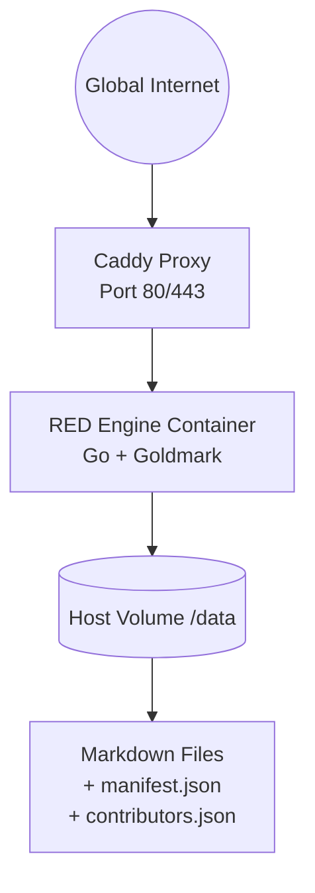

# Project R.E.D Network

## Sovereign Knowledge Node Engine

> **📖 [Installation Guide →](./INSTALL.md)**
> Quick start: `git clone` → `cd RED-Engine` → `./setup.sh install` → `./red`
> Open `http://localhost:8080`

Project R.E.D Network rejects both centralized database monopolies and overly complex distributed consensus protocols. Instead, it systematically decouples the **Independent Data Layer** from the **Social Curation Layer**.

The engine operates as a stateless, high‑performance Go runtime that compiles raw Markdown files into visually polarized technical templates, dynamically injecting cryptographic integrity signatures on every request loop.

## 1. The Philosophy: Red Sovereignty

The internet is broken not from a lack of information, but from a fundamental crisis of architecture. Well‑meaning idealists continually attempt to fix this by proposing centralized chokepoints—a theoretical centralized archive designed to hold all human “how‑to” knowledge in a single, strictly moderated, unified database.

While noble in its intent to provide universal free education, all centralized systems suffer from structural flaws that guarantee its immediate compromise or destruction:

* **The Single Point of Failure:** By attempting to gather all technical knowledge onto a single domain, the Blue System creates an existential target for corporate lawfare and state suppression.
* **The Conflict of Interest:** The moment a platform’s revenue is derived from a percentage of material sales via affiliate links, its neutrality is permanently compromised. Centralized platforms reliant on contextual advertising financially incentivize the prioritization of expensive corporate partner materials over raw, cost‑effective tutorials.
* **The Jury‑Style Delusion:** Relying on an uncompensated “jury” of randomly selected expert verifiers to audit complex technical workflows is an economic fantasy. High‑earning technical professionals will not donate hundreds of hours of uncompensated labor to audit technical execution guides when keeping that operational knowledge exclusive is their livelihood.
* **The Gamified Trust Trap:** Implementing video‑game‑inspired mechanics—such as author “Elo” rankings or weighting votes based on account age—creates a closed aristocracy. This permanently locks out new, highly‑qualified outside experts who refuse to play popularity contests, turning a critical repository into a digital playground.
* **The Dependency Hell of Linear Hierarchies:** Forcing all human knowledge into a rigid, linear hierarchy where Level 4 strictly depends on Level 1 creates a catastrophic maintenance bottleneck. If a foundational tool or component becomes obsolete, the minor change at the bottom breaks every single cascading guide built on top of it.

## 2. How R.E.D. Fixes That

Project R.E.D Network systematically dismantles the architectural vulnerabilities inherent in centralized knowledge repositories.

* **Eradicating the Single Point of Failure:** Open platforms rely mainly on a master domain, creating a massive target for corporate lawfare and global de‑indexing. R.E.D. operates as a stateless containerised engine, eliminating the centralized attack vector entirely.
* **Eliminating Financial Conflicts:** R.E.D. requires zero centralized funding, ensuring information remains free from commercial manipulation, corporate de‑indexing, and review‑bombing botnets.  

* **Outsourcing Content Curation & Bot Defense:** Centralized platforms collapse trying to independently build anti‑bot algorithms and content moderation teams. R.E.D. outsources the social layer to multi‑billion dollar ecosystems like Reddit or Discord. By relying on networks with existing phone‑verification and automated bot mitigation, R.E.D. bypasses the need for a non‑profit to design complex, native bot‑detection firewalls.

* **Bypassing Dependency Hell:** B.L.U.E. enforces a rigid, linear learning hierarchy where a single obsolete foundational guide can collapse the entire structure. R.E.D. prevents this by leveraging native filesystem directories and dynamic versioning, allowing knowledge to adapt organically without cascading failures.

* **Resolving the “Spin‑Off” Paradox:** B.L.U.E. mandates one definitive guide per topic, yet paradoxically suggests forking contested guides during internal disputes, guaranteeing a fractured, redundant database. R.E.D. removes moderation logic from the runtime entirely; the end‑user’s local client seamlessly curates the best version based on established network consensus.

## 3. Core Architectural Counter‑Measures

To address the recurrent theoretical objections regarding security, DDoS attacks, content manipulation, and illegal uploads, the R.E.D. Engine uses hard‑coded cryptographic and infrastructure barriers.

### A. Cryptographic Integrity Verification (Ed25519 + SHA‑256)

R.E.D Engine completely eliminates the threat of unauthorised guide modification using standard SHA‑256 hashes and **Ed25519 signatures**.

- Every `.md` file can be accompanied by a `manifest.json` inside its vault folder.  
  Example entry:
  ```json
  {
    "File.md": {
      "file_hash": "20bcee7014ad5cff...",
      "public_key": "66f32e250b0bafb2...",
      "signature": "61dcac5bd139dca0..."
    }
  }
  ```
- The engine calculates the SHA‑256 hash of the raw file on every request and compares it with the `file_hash` in the manifest.
- If the hash matches, it verifies the Ed25519 signature using the provided public key.
- Finally, it checks whether the public key is **trusted** – listed in the root‑level `contributors.json` file with a human‑readable name.
- If all checks pass, the article shows a green **✅ Verified Contributor** badge with the contributor’s name. The full SHA‑256 checksum is displayed in the footer for manual verification.
- If the file is unsigned, the hash mismatches, or the signer is not trusted, a **⚠️ Unverified / Unknown Origin** badge is shown.

This mechanism requires **no database** – the verification is purely file‑based, stateless, and auditable.

### B. Minimal Attack Surface

Centralized sites are easy targets for DDoS attacks and corporate subpoenas because they rely on massive, active SQL/NoSQL databases holding user data, session state, and platform logic.

- The R.E.D Engine's content layer is **stateless**. Every guide is a raw Markdown file on disk — there is no user database, no session store, no content-management schema to subpoena or breach.
- A lightweight SQLite database (`registry.db`) stores only operational metadata: sync source registry, node settings, and the navigation index. It contains no user data and can be wiped and rebuilt from the filesystem at any time.
- Because content is served natively from file storage, the engine operates with minimal memory overhead and near-zero lookup latency. Containers can be replicated instantly across alternative IP addresses.

### C. Instant Decentralized Mirroring (Import API)

A sovereign network is only as strong as its ability to replicate data rapidly.

- R.E.D. features a built‑in `/import` ingestion endpoint (accessible via the admin panel).
- Node operators can pass any raw Markdown URL, GitHub repository link, or archive (`.zip`, `.tar.gz`) to the engine. The Go runtime will instantly fetch the content, automatically reconstruct the original folder hierarchy on the local drive, and serve it **without requiring a server restart**.
- This allows networks of nodes to rapidly mirror critical data before a master source is taken offline.

### D. Admin Panel & Token Protection

- The admin panel is available at `/-/admin` and is protected by a random `adminToken` set during installation.
- From the panel you can:
  - Import new knowledge bases (single files, GitHub/Gitea repos, archives).
  - List all currently synced sources and remove them with optional local file deletion.
  - Browse the navigation index and trigger a filesystem rescan.
  - Edit node settings (site name, node name) without restarting.
- If no admin token is configured, the node starts in **read‑only lockdown** — content is served but the admin panel returns 401. No credentials are auto‑generated silently.
- Rotate the admin token at any time: `./setup.sh token`

## 4. Architecture: Single‑Container Deployment (Clearnet Only)

Earlier versions experimented with dual‑tier (Clearnet + Tor) isolation, but this proved operationally insecure and unnecessarily complex. The current reference deployment uses a **single container** behind a Caddy reverse proxy.




All components run as standard Podman (or Docker) containers, orchestrated via `podman-compose` (or `docker compose`). The RED engine listens on port `8080` internally, while Caddy provides automatic HTTPS (or plain HTTP on port 80 for local testing).

## 5. Technical Stack Blueprint

- **Language & Runtime:** Go (Golang) — compiles down to a single memory‑safe static binary with zero virtual machine overhead.
- **Markdown Parser:** `goldmark` — highly efficient, fully CommonMark compliant.
- **HTML Sanitizer:** `bluemonday` – strict user‑content policy to prevent XSS.
- **Container Environment:** Multi‑stage minimal Docker/Podman pipeline (Alpine) for complete process isolation and instant replication.
- **Orchestration:** `podman-compose` or `docker compose`.

## 6. Installation & Deployment

**Full installation instructions → [`INSTALL.md`](./INSTALL.md)**

Quick reference:

### Prerequisites
- **Go 1.21+** — [go.dev](https://go.dev/dl/)
- **Node.js 20+** — [nodejs.org](https://nodejs.org/)
- **Git**
- **Docker** or **Podman** (optional, for containerized deployment)

### Quick Start

```bash
git clone https://github.com/RED-Collective/RED-Engine.git
cd RED-Engine
./setup.sh install
./red
```

Open `http://localhost:8080` — admin panel at `/-/admin`.

### Common Commands

| Command | What it does |
|---|---|
| `./setup.sh install` | Install dependencies + build binary + frontend |
| `./setup.sh dev` | Start dev server with live reload (Vite + air) |
| `./setup.sh test` | Run the full Go test suite |
| `./setup.sh build` | Build Go binary + frontend |
| `./setup.sh token` | Show the admin token |
| `./setup.sh status` | Show container status |
| `make build-frontend` | Build only the React SPA |
| `make build-backend` | Build only the Go binary |

See [`INSTALL.md`](./INSTALL.md) for:
- Windows installation
- Docker / Podman deployment
- Step-by-step manual setup
- Federation testing
- Troubleshooting

### Credential Resilience

Credentials are stored in two places intentionally:

- **`.env`** — the primary resilient store, read automatically by Docker/Podman Compose.
- **`config.json`** — optional bootstrap file for the binary.

If `config.json` is deleted or corrupted, the node continues operating normally using the env vars from `.env`. If both are absent, the node starts in **read‑only lockdown** (content served, admin panel disabled) until credentials are restored.

Environment variables (`RED_ADMIN_TOKEN`, `RED_WEBHOOK_SECRET`, `RED_ADDR`, `RED_DATA_DIR`) always override `config.json` values.

## 7. Simulating Knowledge Base Structures

Rather than enforcing a brittle, top‑down linear hierarchy that breaks under dependency hell, R.E.D. leverages your computer’s native filesystem directory tracking. Group, version, and fork your files within folders inside your local storage volume dynamically:

```plaintext
data/
└── remote/
    └── solar-array-build/
        ├── 00-index.md
        ├── 01-wiring-schematics-v1.0.md
        └── 02-inverter-fusing.md
```

The node pathing resolves these automatically into accessible routes:

* `http://your-node/remote/solar-array-build/00-index`

## 8. Cryptographic Verification in Depth

### `contributors.json` (root of the repository)
```json
[
  {
    "name": "StandardCodebase",
    "public_key": "66f32e250b0bafb2683ae987e65a390901f030ccbc7745435d99f35da1bfccf1",
    "contact-information": { ... }
  }
]
```
Only public keys listed here are considered **trusted**. The `name` field is displayed in the verified badge.

### `manifest.json` (inside any vault folder)
```json
{
  "relative/path/to/file.md": {
    "file_hash": "sha256-of-file-content",
    "public_key": "same-as-in-contributors.json",
    "signature": "ed25519-signature-of-the-file-content"
  }
}
```
- The signature must be computed **over the raw file content** (not over the hash).
- The engine automatically walks the entire `dataDir`, finds all `manifest.json` files, and matches each `.md` file to its entry.

### Verification Flow (per request)
1. Read `.md` file → compute SHA‑256 → compare with `file_hash` from manifest.
2. If hash matches, decode public key and signature (hex).
3. Verify using Go’s `ed25519.Verify(publicKey, fileContent, signature)`.
4. If valid, look up the public key in `contributors.json` → if found, set `Verified=true` and `Author=contributor.name`.
5. Otherwise, set `Verified=false` and `Author="Unverified / Unknown Origin"`.
6. Inject badges and SHA‑256 footer into the HTML template.

This design ensures that **readers always know the provenance** of every guide, and that **malicious alterations** (even a single character) break the hash, immediately flagging the content as untrusted.

## 9. Curation Philosophy: The Sovereign Web‑of‑Trust

1. **The Software Only Knows State:** The Go runtime handles zero moderation logic. It treats strings objectively.
2. **Cryptographic Peer Review:** Instead of relying on a centralized platform’s voting buttons or video‑game‑inspired Elo rankings, users and curators sign content hashes with their independent cryptographic keys (Ed25519).
3. **End‑User Agency:** You, the reader, choose which curators to trust. Your local index client aggregates links signed by your trusted network.

The creator of the Blue System lamented that he lacked the millions of dollars needed for a startup, resigning himself to the belief that his vision would never be a reality. He failed because he thought like a corporate founder seeking capital.

**We do not need capital. We do not need permission. We do not need a master website.**

It’s about time we stop waiting for someone or something to fix our problems for us. No hero is coming.

**Claim Your Agency. Run a Node.**

---

## ⚖️ License & Attribution

**R.E.D-Engine** is part of **Project R.E.D Network** and is licensed under the
**GNU Affero General Public License v3.0 (AGPL-3.0)** — see [`LICENSE`](./LICENSE).

Per **AGPL-3.0 Section 7(b)**, an additional attribution term applies: any copy,
modified version, or derivative — **including a modified version operated as a
network service** — must preserve the credit

> **Powered by [RED Collective](https://github.com/RED-Collective).**

in the notices the software displays to its users (the web UI footer, the server
startup banner / `--version`, and this README). The exact, binding terms are in
[`ADDITIONAL_TERMS.md`](./ADDITIONAL_TERMS.md).

© 2026 RED Collective · <https://github.com/RED-Collective>

---

## Changelog

### 2026-06-02

**Federation & Peer Identity**
- Peer identity is now anchored to the Ed25519 public key. The registered URL is treated as a mutable secondary property — rotating a tunnel no longer orphans a peer record.
- Added challenge-response URL re-registration for nodes behind dynamic cloudflared tunnels: a peer requests a single-use nonce (5-minute TTL), signs `nonce|new_url` with its private key, and submits the signature. Constant-time comparison prevents timing attacks; the nonce is deleted on first use to prevent replay.
- Added gossip import: pulling a peer's public peer list and registering unknown nodes as upstream-only consumers with zero manual configuration.
- Added peer health history tracking with per-peer last-seen timestamps and sequential failure counts stored in the registry.

**Database Schema (v2)**
- Migrated `exported_paths` from a serialized column to a normalized `peer_exported_paths` junction table, enabling clean per-path queries without string parsing.
- Added `UNIQUE` constraint on `peers.public_key` and `CHECK` constraints on `peer_type` (`upstream`, `downstream`, `mirror`) and `tunnel_type` (`cloudflared`, `direct`).
- Added `startup_sync` health columns: `last_synced_at`, `last_error`, `consecutive_failures`.

**API Layer**
- Added `/api/content` JSON endpoint: resolves articles (with `RED_KNOWLEDGE` directory-default fallback), rewrites `.assets/` image paths to `/-/assets/` for client rendering, and returns breadcrumbs, prev/next sibling links, and verification state.
- Added `/api/recent-files` endpoint: walks all sections, sorts by filesystem mtime, returns top N articles with correct display paths for `RED_KNOWLEDGE` defaults.
- Added `/api/search-index` endpoint: returns full title + path index for client-side search, with no-cache headers.
- Added `/-/admin/verify` no-op endpoint for admin token validation without performing side effects.

**Frontend**
- Introduced a React SPA (Vite) served from `static/dist/`. All browser-navigation routes (`/`, `/-/admin`, `/-/nodes`, article paths) serve `static/dist/index.html`. Go templates are retained as a fallback when the SPA is not built.
- Vite assets served from `/assets/` (dist output) alongside the existing `/-/assets/` content-file handler.

**Content Pipeline**
- Image src rewriting: bare filenames in Markdown AST (`imageTransformer`) are rewritten to `/-/assets/{dir}/{filename}` at render time. A second pass in `/api/content` rewrites any remaining `.assets/`-relative srcs to absolute paths for the SPA.
- File watcher (`radovskyb/watcher`) triggers hot-reload of individual articles on change. Remote sync sets a `remoteSyncActive` atomic flag with a 4-second cooldown to suppress redundant local events during pulls.

**Attribution & License**
- AGPL-3.0 §7(b) attribution ("Powered by RED Collective.") enforced in all UI surfaces: React SPA footer, all five Go templates, and the server startup banner. Tagged `Attribution required by NOTICE (AGPL-3.0 §7(b)) — do not remove` at every insertion point.
