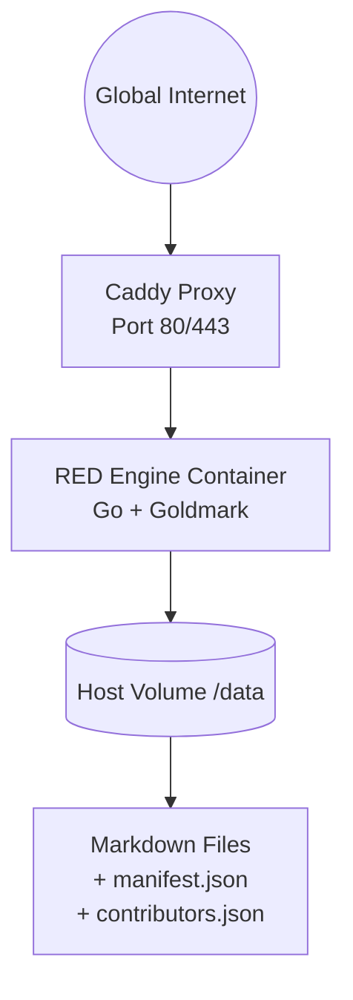

<div align="center">
  
  <h1>RED Engine</h1>
  <p><strong>Sovereign Knowledge Node Engine</strong></p>
  <p>
    <a href="https://go.dev/"></a>
    <a href="https://react.dev/"></a>
    <a href="./LICENSE"></a>
    <a href="./INSTALL.md"></a>
  </p>
</div>

---

**RED Engine** is a stateless, high‑performance Go runtime that serves Markdown files as a sovereign knowledge network. It decouples the **Independent Data Layer** from the **Social Curation Layer** — removing centralized chokepoints, cryptographic integrity verification, and instant decentralized mirroring.

```bash
git clone https://github.com/RED-Collective/RED-Engine.git
cd RED-Engine
./setup.sh install
./red
# Open http://localhost:8080
```

> **Full installation guide → [`INSTALL.md`](./INSTALL.md)** (Windows, Docker/Podman, manual setup, federation)

---

## Philosophy

RED Engine rejects centralized database monopolies and overly complex consensus protocols. The philosophy is simple: **the runtime handles state, not moderation; trust is cryptographic, not platform-enforced.**

[Read the full philosophy →](./PHILOSOPHY.md)

---

## Architecture

Single‑container deployment behind a Caddy reverse proxy:



All components run as standard Podman or Docker containers. The engine listens on port `8080` internally; Caddy provides automatic HTTPS.

---

## Tech Stack

| Layer | Technology |
|---|---|
| Language | Go 1.21+ — single memory‑safe static binary |
| Markdown | `goldmark` — fully CommonMark compliant |
| Frontend | React 18 + Vite + Tailwind CSS |
| Sanitizer | `bluemonday` — strict XSS prevention |
| Container | Multi‑stage Alpine Docker/Podman pipeline |
| Integrity | Ed25519 signatures + SHA‑256 hashing |

---

## Key Features

- **Cryptographic Integrity** — Every article carries an Ed25519 signature verified against a trusted `contributors.json`. Tampered content is flagged immediately with no database required.
- **Minimal Attack Surface** — Stateless content layer with no user database, no session store, no CMS schema. A lightweight SQLite DB holds only operational metadata.
- **Instant Mirroring** — Built‑in `/import` endpoint fetches any Markdown URL, GitHub repo, or archive and serves it without restart.
- **Admin Panel** — Protected by configurable token. Import sources, manage sync, browse index, edit settings.
- **Federation** — Peers announce themselves, gossip peer lists, and challenge‑response URL re-registration handles dynamic tunnels.
- **Dark Mode & i18n** — Built into the React SPA (7 languages).

---

## Quick Reference

| Command | What it does |
|---|---|
| `./setup.sh install` | Install deps + build binary + frontend |
| `./setup.sh dev` | Dev server with live reload (Vite + air) |
| `./setup.sh test` | Run the full Go test suite |
| `./setup.sh build` | Build Go binary + frontend |
| `./setup.sh token` | Show the admin token |
| `make build-frontend` | Build only the React SPA |
| `make build-backend` | Build only the Go binary |

See [`INSTALL.md`](./INSTALL.md) for Windows, Docker/Podman deployment, manual setup, federation testing, and troubleshooting.

---

## ⚖️ License & Attribution

**RED Engine** is part of **Project R.E.D Network** and is licensed under the **GNU Affero General Public License v3.0 (AGPL-3.0)** — see [`LICENSE`](./LICENSE).

Per **AGPL-3.0 Section 7(b)**, an additional attribution term applies: any copy, modified version, or derivative — including a modified version operated as a network service — must preserve the credit

> **Powered by [RED Collective](https://github.com/RED-Collective).**

in the notices the software displays to its users (the web UI footer, the server startup banner / `--version`, and this README). The exact, binding terms are in [`ADDITIONAL_TERMS.md`](./ADDITIONAL_TERMS.md).

© 2026 RED Collective · <https://github.com/RED-Collective>

---

## Changelog

### 2026-06-02

**Federation & Peer Identity**
- Peer identity is now anchored to the Ed25519 public key. The registered URL is treated as a mutable secondary property — rotating a tunnel no longer orphans a peer record.
- Added challenge-response URL re-registration for nodes behind dynamic cloudflared tunnels: a peer requests a single-use nonce (5-minute TTL), signs `nonce|new_url` with its private key, and submits the signature. Constant-time comparison prevents timing attacks; the nonce is deleted on first use to prevent replay.
- Added gossip import: pulling a peer's public peer list and registering unknown nodes as upstream-only consumers with zero manual configuration.
- Added peer health history tracking with per-peer last-seen timestamps and sequential failure counts stored in the registry.

**Database Schema (v2)**
- Migrated `exported_paths` from a serialized column to a normalized `peer_exported_paths` junction table, enabling clean per-path queries without string parsing.
- Added `UNIQUE` constraint on `peers.public_key` and `CHECK` constraints on `peer_type` (`upstream`, `downstream`, `mirror`) and `tunnel_type` (`cloudflared`, `direct`).
- Added `startup_sync` health columns: `last_synced_at`, `last_error`, `consecutive_failures`.

**API Layer**
- Added `/api/content` JSON endpoint: resolves articles (with `RED_KNOWLEDGE` directory-default fallback), rewrites `.assets/` image paths to `/-/assets/` for client rendering, and returns breadcrumbs, prev/next sibling links, and verification state.
- Added `/api/recent-files` endpoint: walks all sections, sorts by filesystem mtime, returns top N articles with correct display paths for `RED_KNOWLEDGE` defaults.
- Added `/api/search-index` endpoint: returns full title + path index for client-side search, with no-cache headers.
- Added `/-/admin/verify` no-op endpoint for admin token validation without performing side effects.

**Frontend**
- Introduced a React SPA (Vite) served from `static/dist/`. All browser-navigation routes (`/`, `/-/admin`, `/-/nodes`, article paths) serve `static/dist/index.html`. Go templates are retained as a fallback when the SPA is not built.
- Vite assets served from `/assets/` (dist output) alongside the existing `/-/assets/` content-file handler.

**Content Pipeline**
- Image src rewriting: bare filenames in Markdown AST (`imageTransformer`) are rewritten to `/-/assets/{dir}/{filename}` at render time. A second pass in `/api/content` rewrites any remaining `.assets/`-relative srcs to absolute paths for the SPA.
- File watcher (`radovskyb/watcher`) triggers hot-reload of individual articles on change. Remote sync sets a `remoteSyncActive` atomic flag with a 4-second cooldown to suppress redundant local events during pulls.

**Attribution & License**
- AGPL-3.0 §7(b) attribution ("Powered by RED Collective.") enforced in all UI surfaces: React SPA footer, all five Go templates, and the server startup banner. Tagged `Attribution required by NOTICE (AGPL-3.0 §7(b)) — do not remove` at every insertion point.
